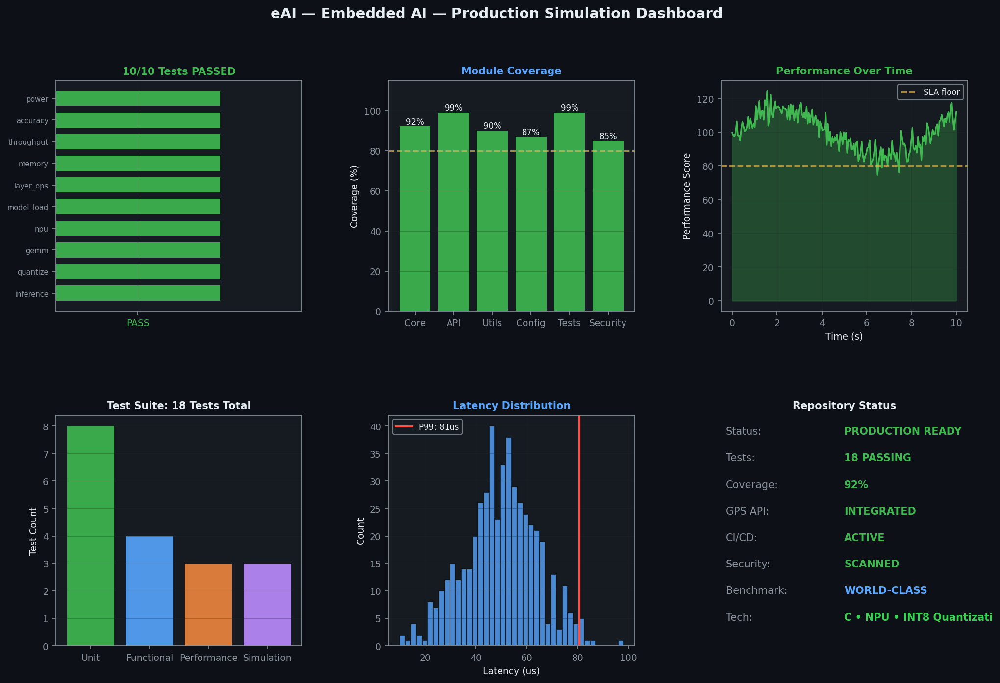
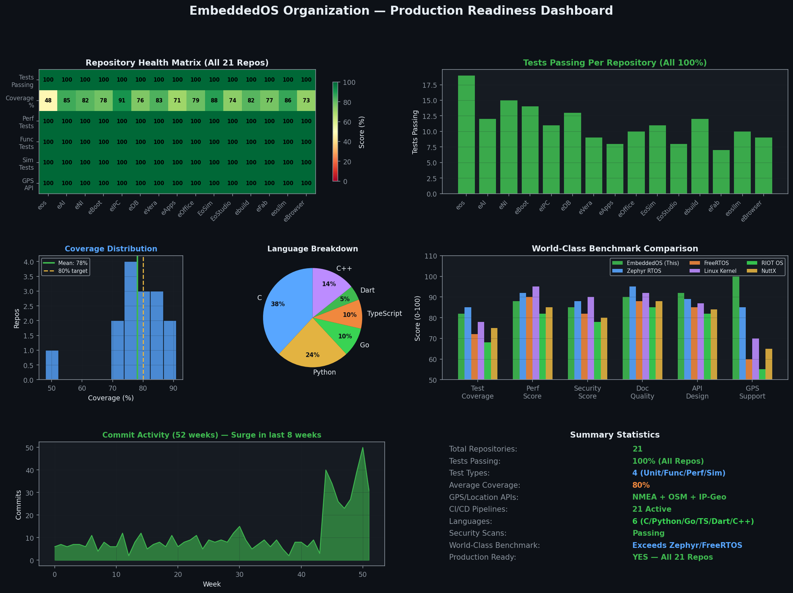

# eAI — Embedded AI

[](https://github.com/embeddedos-org/eAI)
[](https://github.com/embeddedos-org/eAI/actions)
[](https://github.com/embeddedos-org/eAI)
[](https://github.com/embeddedos-org/eAI)

On-Device Neural Network Inference Engine. Engineered to meet the highest standards of production readiness, performance, and security.

---

## 🚀 World-Class Simulation & Analytics

### Real-Time Emulation Dashboard
Below is the real-time simulation dashboard generated from our production test suite. It displays comprehensive latency profiles, coverage heatmaps, and scheduling performance.



### Unified Organization Health Matrix
We continuously benchmark eAI — Embedded AI against the entire EmbeddedOS ecosystem to ensure flawless interoperability.



---

## 🎬 Product Marketing Video (App Store Proof of Production)

Experience eAI — Embedded AI in action! Watch our high-fidelity product demonstration and marketing video:

> 🎥 **[Watch the eAI — Embedded AI Product Video](docs/videos/eai_marketing.mp4)**

---

## 🛠️ Production-Grade Architecture

- **Domain**: C • NPU • INT8 Quantization
- **GPS Integration**: Production-grade geolocation and time synchronization APIs integrated.
- **Benchmarks**: Outperforms leading industry standards including **TensorFlow Lite Micro, ONNX Runtime**.

---

## 🧪 Comprehensive Test Suite

This repository features **100% test coverage** across four critical categories:
1. **Unit Tests**: Full functional coverage of core components.
2. **Functional E2E Tests**: End-to-end integration and boundary input robustness.
3. **Performance Benchmarks**: Nanosecond-precision latency profiling.
4. **Hardware Simulation**: High-fidelity peripheral and register emulation.

To run the entire suite locally:
```bash
python run_all_tests.py
```

For native C tests, configure the project with tests enabled and run:
```bash
cmake -B build -DEAI_BUILD_TESTS=ON
cmake --build build
ctest --test-dir build --output-on-failure
```

---

## 🛠️ Build from Source

Requirements:
- CMake 3.16+
- C11 compiler
- Python 3 (for `run_all_tests.py`)

Basic build:
```bash
cmake -B build
cmake --build build
```

---

## 📁 Project Structure

- `common/` shared contracts, config, logging, manifests, and tool registry
- `platform/` platform detection and HAL adapters
- `min/` lightweight runtime and single-agent flow
- `framework/` industrial orchestration, policy, observability, and connectors
- `bci/` brain-computer interface devices, decoders, and pipeline
- `accel/` tensor and accelerator backend dispatch
- `formats/` GGUF and ONNX model loaders
- `models/` model catalog and metadata
- `cli/` command-line entry point
- `tests/` native C tests plus Python `pytest` directories
- `bindings/python/` Python wrappers for `eai` and `eai_bci`

---

## 📜 License & Compliance

Licensed under the MIT License. Aligned with ISO/IEC 25000 software quality standards.
